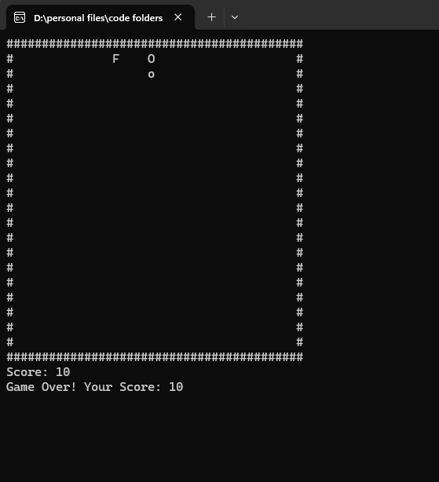

# Snake Game

A classic Snake game implemented in C, featuring smooth gameplay and a console-based interface. This project demonstrates basic game development concepts, including input handling, rendering, and collision detection, in the C programming language.



## Features

- **Smooth Gameplay**: Enjoy responsive and smooth snake movement.
- **Scoring System**: Tracks and displays the player's score.
- **Simple Controls**: Navigate the snake using the arrow keys or `WASD`.
- **Dynamic Environment**: Random fruit generation and growing snake tail.

## Technologies Used

- **Programming Language**: C
- **Libraries**: 
  - `conio.h` for input handling
  - `windows.h` for delay (`Sleep`) function

## Installation

Clone the repository:

```bash
git clone https://github.com/proobker/Snake_Game.git
```

Navigate to the project directory:

```bash
cd Snake_Game
```

Compile the source code:

```bash
gcc snake_game.c -o snake_game
```

Run the game:

```bash
./snake_game
```

## Usage

- Use `W`, `A`, `S`, `D` or arrow keys to move the snake.
- Collect fruits to grow the snake and increase your score.
- Avoid running into the walls or the snake's own tail.
- Press `X` to quit the game.

## Screenshots


## Contribution

Contributions are welcome! Follow these steps to contribute:

1. Fork this repository.
2. Create a new branch:
   ```bash
   git checkout -b feature-name
   ```
3. Commit your changes:
   ```bash
   git commit -m "Add feature description"
   ```
4. Push to the branch:
   ```bash
   git push origin feature-name
   ```
5. Create a pull request.

## License
This project is licensed under the [MIT License](LICENSE).

## Contact

For queries or feedback, contact:

- **Email**: rrabi.dahal@gmail.com
- **GitHub**: [proobker](https://github.com/proobker)

Thank you for exploring this repository! We hope this project inspires your game development journey.
